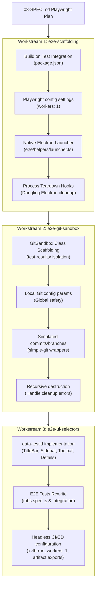

# Playwright E2E Integration Tracking & Checklist

This tracking document breaks down the Playwright E2E testing infrastructure setup specified in `03-SPEC.md` into actionable, sequential workstreams and specific tasks.

## Workstream Architecture Overview



---

## 🛠️ Workstream Checklist

### 📦 Workstream 1: E2E Scaffolding & Build Pipeline (`e2e-scaffolding`)
**Status:** ✅ Completed | **Branch:** `e2e-scaffolding`  
**Goal:** Hook up native Electron application bootstrap and compile production assets automatically before running E2E tests.

- [x] **Task 1.1: Build-on-Test integration in `package.json`**
  - **Action:** Update the `"test:e2e"` script in [package.json](file:///Users/kamildabrowski/projects/ultra-git/package.json) to execute `electron-vite build` prior to starting Playwright.
  - **Acceptance:** Running `bun run test:e2e` triggers compilation. If compilation fails, the E2E test suite aborts immediately.
- [x] **Task 1.2: Single Worker configuration in Playwright config**
  - **Action:** Configure `workers: 1` in [playwright.config.ts](file:///Users/kamildabrowski/projects/ultra-git/playwright.config.ts).
  - **Reason:** Spawning multiple concurrent local native Electron windows causes focus theft and local file locking conflicts.
- [x] **Task 1.3: Native Electron application launcher**
  - **Action:** Create `e2e/helpers/launcher.ts` (or standard fixture) that exports `launchElectronApp`. It must use Playwright's `_electron.launch()` targeting the production compile `./out/main/index.js` and wait for the window load state.
  - **Acceptance:** Replaces standard web page fixtures (`page.goto`) with authentic Electron process launches.
- [x] **Task 1.4: Zombie process prevention and teardown hooks**
  - **Action:** Ensure standard teardown hooks (e.g. `app.close()`) are invoked under `afterEach`/`afterAll` to clean up spawned Electron helper processes.
  - **Acceptance:** Verify no lingering Electron tasks remain in the operating system's process table after test runs.

---

### 🧪 Workstream 2: Git Sandbox & Test Isolation (`e2e-git-sandbox`)
**Status:** ✅ Completed | **Branch:** `e2e-git-sandbox`  
**Goal:** Standardize a secure, programmatically isolated local Git workspace sandbox for real-world operations testing.

- [x] **Task 2.1: Workspace isolation inside git-ignored path**
  - **Action:** Confirm that [test-results/](file:///Users/kamildabrowski/projects/ultra-git/test-results) is in `.gitignore` to prevent any created repositories from being tracked in the project.
- [x] **Task 2.2: Implement `GitSandbox` helper class**
  - **Action:** Create `e2e/helpers/git-sandbox.ts` to manage temporary test directories using a unique UUID format (e.g. `test-results/sandbox-<uuid>`).
- [x] **Task 2.3: Enforce global config safety**
  - **Action:** Inside `GitSandbox.init()`, run commands locally and pass distinct configuration parameters or write config to the local repo (`git config user.name "Test User"`, `git config user.email "test@example.com"`) to guarantee global configurations are untouched.
  - **Acceptance:** No test leaks or modifies global user-level configurations.
- [x] **Task 2.4: Implement real-world simple-git simulators**
  - **Action:** Build helper methods inside `GitSandbox` to programmatically seed stashes, branches, commits, and tags on the fly.
- [x] **Task 2.5: Safe directory cleanup and tear-down**
  - **Action:** Implement a `destroy()` method to recursively delete folders on test termination, properly handling potential Windows/macOS filesystem file locks.

---

### 🎨 Workstream 3: Resilient Selectors & CI Integration (`e2e-ui-selectors`)
**Status:** ✅ Completed | **Branch:** `e2e-ui-selectors`  
**Goal:** Standardize component identifier attributes and execute headless testing with artifact captures on CI/CD pipelines.

- [x] **Task 3.1: Audit and inject React components test IDs**
  - **Action:** Open and update components with explicit `data-testid` attributes instead of raw CSS class references:
    - [TitleBar.tsx](file:///Users/kamildabrowski/projects/ultra-git/src/renderer/src/components/layout/TitleBar.tsx): `data-testid="repo-tab"`, `data-testid="repo-tab-title"`, `data-testid="close-tab-btn"`.
    - [Sidebar.tsx](file:///Users/kamildabrowski/projects/ultra-git/src/renderer/src/components/sidebar/Sidebar.tsx): `data-testid="sidebar-branch-indicator"`, `data-testid="sidebar-stash-count"`.
    - [Toolbar.tsx](file:///Users/kamildabrowski/projects/ultra-git/src/renderer/src/components/toolbar/Toolbar.tsx): `data-testid="toolbar-fetch-btn"`, `data-testid="toolbar-push-btn"`, etc.
    - [DetailsPanel.tsx](file:///Users/kamildabrowski/projects/ultra-git/src/renderer/src/components/details/DetailsPanel.tsx): `data-testid="details-panel-title"`.
- [x] **Task 3.2: Rebuild and complete `tabs.spec.ts` E2E test suite**
  - **Action:** Rewrite [tabs.spec.ts](file:///Users/kamildabrowski/projects/ultra-git/e2e/tabs.spec.ts) using the new Electron launcher and the `GitSandbox` helper. Mock native folder dialogs or hook IPC responses if required, and verify tab switching, adding, and closing actions.
  - **Acceptance:** Green E2E test executions using robust locators and clean teardown.
- [x] **Task 3.3: Headless Linux CI configuration (`.github/workflows/e2e.yml`)**
  - **Action:** Set up/update GitHub action to run E2E on pushes/PRs. Use `xvfb-run` inside virtual framebuffers to allow native window spawns on Linux nodes. Set worker counts to 1.
  - **Acceptance:** Green CI execution. On test failure, Playwright HTML reports and traces must be captured and uploaded to Github workflow artifacts for inspection.

---

## 🏃 Execution & Switch Playbook

To switch between workstreams and maintain clean context isolation, follow these step-by-step commands:

1. **Check active workstream list:**
   ```bash
   node .agents/gsd-core/bin/gsd-tools.cjs workstream list
   ```

2. **Select a workstream to operate in:**
   ```bash
   node .agents/gsd-core/bin/gsd-tools.cjs workstream set <workstream-name>
   ```

3. **Verify active status:**
   ```bash
   node .agents/gsd-core/bin/gsd-tools.cjs workstream status <workstream-name>
   ```
