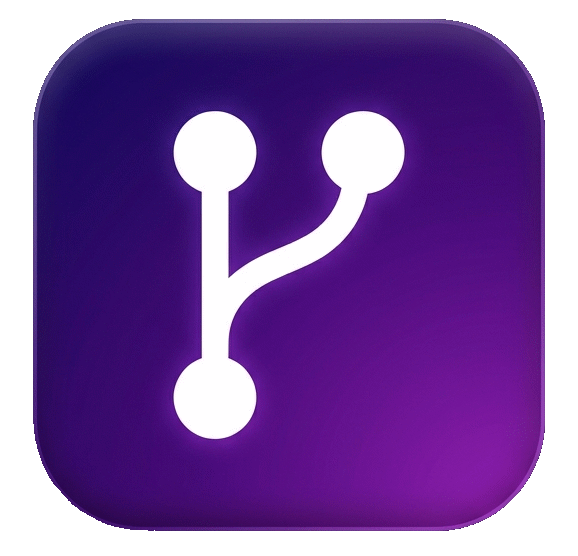
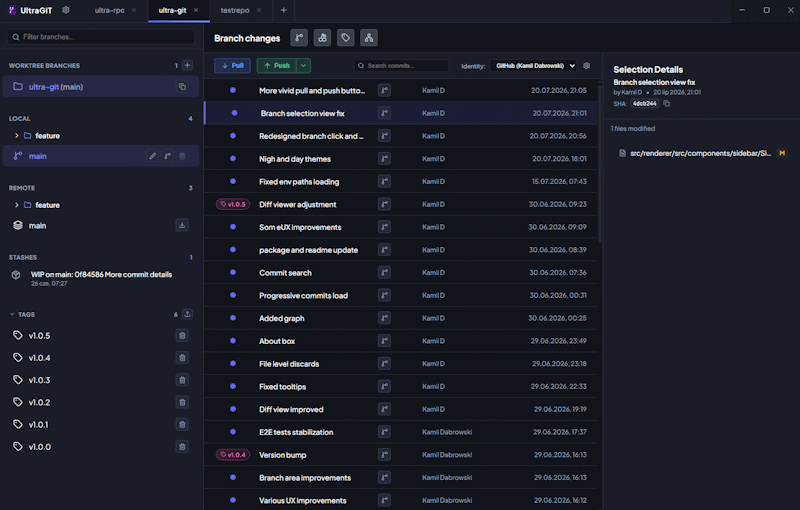

# UltraGIT

<p align="center">
  
</p>

<h1 align="center">UltraGIT</h1>

<p align="center">
  <em>A worktree native desktop Git client with multi-repo workspaces, and developer identity management — built with Electron, React, and TypeScript.</em>
</p>

---

## 🎯 Overview

<p align="center">
  
</p>

UltraGIT is a cross-platform desktop Git client designed for developers who want a premium, visual Git experience without sacrificing raw Git power. It combines an intuitive dark-mode interface with advanced features — automatic conflict resolution, multi-repo tabbed workspaces, and integrated identity management — so you can handle complex workflows effortlessly.

### Why UltraGIT?

| Challenge | UltraGIT Solution |
|-----------|-------------------|
| Merge conflicts are painful and time-consuming | **Assistive Conflict Resolver** with 3-pane comparison, hunk-by-hunk resolution, and Ours/Theirs/Both strategies |
| Switching between multiple repos requires multiple windows | **Tabbed Multi-Repo Workspace** — open and manage multiple repositories side by side |
| Managing multiple Git identities across projects is messy | **Developer Identity Profiles** — configure per-repo name, email, SSH keys, and API tokens for GitHub/GitLab/Bitbucket |
| Worktrees are powerful but hard to visualize | **Built-in Worktree Manager** — create, switch, and remove worktrees with safety constraints and visual indicators |
| Branch folders get cluttered in large repos | **Folder-Grouped Sidebar** — branches auto-grouped by `/` delimiters with collapsible tree nodes |
| Hard to track what's pushed and what's not | **Visual Commit Graph** with sync status indicators (globe/circle icons) and keyboard navigation |

---

## ⚡ Quick Start Guide

New to UltraGIT? Here is how to get up and running in 60 seconds.

### 1. Open a Repository
- On the Welcome screen, click **Open Local Repository** or use the **+** tab button.
- Select any Git repository folder from your machine using the native directory picker.
- The repository loads instantly with branches, commit history, and working directory status.

### 2. Explore the Sidebar
- **Local Branches**: Your branches are grouped by folder (e.g., `feature/login` shows under `feature/`). The active branch is highlighted with ahead/behind counts (`↑` / `↓`).
- **Remote Branches**: All remote branches listed alphabetically under their remote names.
- **Stashes**: View, pop, or drop stash entries with timestamps.
- **Tags**: Browse and manage tags — create from HEAD or push all tags to remote.
- **Worktrees**: Manage parallel working directories, with automatic branch isolation to prevent conflicts.
- Use the **filter input** at the top to quickly find any branch, remote, or worktree.

### 3. Make Changes & Commit
- The **Active Changes** panel shows staged and unstaged files with status badges (`M`, `A`, `D`, `?`).
- Stage/unstage individual files or all at once with one click.
- Review diffs in the **split-view diff modal** with word-level inline highlights and an interactive overview ruler.
- Write your commit message and hit **Commit**.

### 4. Sync with Remote
- Use the **Sync Panel** to pull, push, or set upstream.
- **Pull** fetches and merges — if conflicts occur, the Conflict Resolver opens automatically.
- **Push** warns if you're behind remote and offers to pull first or force push.
- **Set Remote**: Configure remote URL and name. If the repository doesn't exist on GitHub or GitLab, UltraGIT can **auto-create it** using your API token.

### 5. Configure Your Identity
- Open **Identity Profiles** from the settings area.
- Create a profile with your Git name, email, and SSH private key.
- Paste a GitHub, GitLab, or Bitbucket API token — UltraGIT validates it, downloads your avatar, and auto-fills your details.
- Select a profile per repository; it automatically configures `user.name`, `user.email`, and `core.sshCommand`.

---

## ✨ Features

### 📂 Multi-Repository Workspace (Tabs)
- **Tabbed Interface**: Manage multiple Git repositories simultaneously in a clean tabbed layout.
- **Native Repository Loader**: Open local repositories using a native directory selection dialog.
- **Workspace Persistence**: Active repositories are saved to `localStorage` and automatically restored on startup.
- **Landing Welcome Page**: Quick action shortcuts when no repository tabs are open.
- **About Dialog**: Styled dialog accessible from the titlebar showing version details.

### 🌿 Folder-Grouped Sidebar Navigation
- **Sidebar Filter**: Sticky search input for real-time filtering of branches, remotes, and worktrees.
- **Folder-Grouped Tree View**: Local and remote branches grouped by folder structures (delimited by `/`).
  - Collapsible/expandable folder nodes with custom icons.
  - Folder containing the active branch is auto-expanded.
  - Top-level remote name (e.g., `origin/`) is stripped under the Remote section.
- **Branch Management**: Create, rename, delete branches with safety checks and force-delete prompts.
- **Advanced Merging & Rebase**: Merge with strategy presets (fast-forward, `--no-ff`, `--squash`) or rebase onto selected branches.
- **Checkout Integration**: Switching branches in a worktree automatically switches the repository path.

### 📋 Git Worktrees
- **Add Worktree Modal**: Create worktrees from local/remote branches with path validation and folder browsing.
- **Worktree Isolation**: Branches checked out in extra worktrees are hidden from the local branches list.
- **Safety Constraints**: Branch deletion, renaming, and creation are restricted inside active worktrees.
- **Worktree Actions**: Merge/rebase worktree branches, copy paths, or remove worktrees.

### 📦 Stashes & Tags
- **Stashes**: List all stash entries with relative timestamps and descriptions.
  - View stash files and diffs in the diff modal.
  - Pop stashes (with merge conflict warnings) or drop stashes.
- **Tags**: Alphabetic listing with collapsible section toggle.
  - Create tags from HEAD, delete local tags (with remote sync option), push all tags to remote.

### 📊 Visual Commit Log & Sync
- **Commit History Graph**: Interactive timeline with commit messages, authors, dates, and sync status.
- **Commit Search & Filter**: Search and filter commits by message.
- **Pagination**: "Load More" button for progressive loading beyond the initial 100 commits.
- **Visual Branch Graph Modal**: Dedicated node-based interactive graph diagram.
- **Sync Status Indicators**: Globe (behind), empty circle (ahead), filled circle (in-sync).
- **Keyboard Navigation**: `ArrowUp` / `ArrowDown` to navigate commits with auto-scroll and detail loading.
- **Cherry-Picking**: Cherry-pick any commit directly into your current branch, with conflict handling.
- **Sync Panel**: Pull, push, set upstream, and auto-create remote repos on GitHub/GitLab.

### 👤 Developer Identity Profiles
- **Multi-Identity Manager**: Create and select profiles for different repositories.
- **SSH Private Keys**: Configure per-repo SSH commands with file browse dialog.
- **API Token Integration**: Connect GitHub, GitLab, or Bitbucket tokens — validates, downloads avatar, auto-fills Git config.
- **Automatic Git Config**: Modifies local repo config on profile select and cleans up on removal.

### 📝 Active Changes (Working Directory)
- **Staged & Unstaged Columns**: File lists with status badges (`M`, `A`, `D`, `?`) and rename indicators.
- **Quick Actions**: Stage/unstage individual files or all changes.
- **File Discards**: Reset individual files with confirmation modal.
- **Identity Alerts**: Warning banners when no identity is selected.
- **Height Resizable**: Drag handle with persisted layout state.

### 🔍 Code Diff Viewer
- **Split Diff View**: Line-by-line comparison with additions (green) and deletions (red).
- **Word-Level Highlights**: Character-level and word-level inline edits.
- **Jump-to-First-Change**: Auto-scroll to the first code change.
- **Interactive Overview Ruler**: Color-coded vertical stripes; click to jump to changes.
- **Binary File Safety**: Detects binary files and shows a user-friendly message.
- **Contextual Diffing**: Supports commits, stashes, and staged/unstaged files.

---

## 🧠 Deep Dive: Conflict Resolver

UltraGIT's standout feature is its **Assistive Conflict Resolver** — designed to turn the most painful part of Git into a guided, visual experience.

### 🔄 Auto-Triggered Flow
When a merge, rebase, or cherry-pick results in conflicts, the Conflict Resolver opens automatically. You don't need to hunt for conflict markers in your files — the resolver presents each conflict hunk in a structured 3-pane layout.

### 🪟 3-Pane Comparison Layout
- **Ours** (left): Your current branch's version.
- **Theirs** (right): The incoming changes.
- **Result Preview** (bottom/center): Live preview of the resolved output.

### 🎯 Resolution Strategies
For each conflict hunk, choose from three strategies:
- **Accept Ours**: Keep your current branch's changes.
- **Accept Theirs**: Take the incoming changes.
- **Accept Both**: Join both sections together (ours first, then theirs).

Navigate between hunks with tab selectors. Once resolved, the code is written back to the file and staged automatically.

---

## 🚀 Getting Started

### Prerequisites

| Requirement | Version |
|-------------|---------|
| [Node.js](https://nodejs.org/) | v18 or higher |
| [Bun](https://bun.sh/) | v1.x or higher |
| [GSD](https://www.npmjs.com/package/@opengsd/gsd-core) | Latest (for agent workflows) |

### Install & Run

```bash
# Clone the repository
git clone https://github.com/CamelDev/ultra-git.git
cd ultra-git

# Initialize GSD (if .agents/ is missing)
npx @opengsd/gsd-core@latest

# Install dependencies
bun install

# Run development server
bun run dev
```

---

## 🏗 Architecture & Tech Stack

| Layer | Technology |
|-------|------------|
| **Framework** | Electron (main process + preload + renderer) |
| **Frontend** | React 19 + TypeScript |
| **State Management** | Zustand (repository and identity state) |
| **Styling** | Vanilla CSS with CSS variables, dark-mode, glassmorphism, flexbox panels, resizable layouts |
| **Git Operations** | `simple-git` — async child process spawning |
| **Package Manager** | Bun |
| **Testing** | Playwright (Electron E2E) |
| **Icons** | Lucide React |

---

## 📦 Build & Package

Build the application for distribution:

```bash
# Build the renderer and main process
bun run build

# Build and package for all platforms
bun run build:all
```

### 🍎 macOS
Generates a DMG installer.
```bash
bun run build:all
```
- **Output**: `dist/UltraGIT-1.0.5.dmg`

### 🪟 Windows
Generates an NSIS installer.
```bash
bun run build:all
```
- **Output**: `dist/UltraGIT-Setup-1.0.5.exe`

### 🐧 Linux
Creates a portable AppImage.
```bash
bun run build:all
```
- **Output**: `dist/UltraGIT-1.0.5.AppImage`

---

## 🧪 Testing

We use [Playwright](https://playwright.dev/) for End-to-End (E2E) testing. The tests launch a real Electron instance to verify all critical user flows:
- **Sidebar**: Branch creation, filtering, folder grouping, and preview.
- **Commits**: Diff viewing, filtering, load-more pagination, cherry-pick, squash, and reset.
- **Active Changes**: Staging/unstaging, auto-refresh, and sync status.
- **Worktrees**: Creation, isolation, and safety constraints.
- **Conflict Resolver**: Merge conflict detection and resolution flow.
- **Identity Profiles**: Profile creation, SSH key configuration, and API token integration.
- **Tabs & Navigation**: Multi-repo tab management and workspace persistence.

> [!IMPORTANT]
> **Build Prerequisite**: Because E2E tests target the built application, you **must** run `bun run build` before running tests. The `test:e2e` script handles this automatically.

### Run Tests

```bash
# Run all tests (automatically builds the app)
bun run test:e2e

# Run a specific test file
npx playwright test e2e/conflict-resolver.spec.ts

# Open UI mode for debugging
npx playwright test --ui

# View trace for a failed test
npx playwright show-trace test-results/<test-directory>/trace.zip
```

> [!NOTE]
> Tests are isolated and use temporary directories to ensure consistency across runs.

---

## 🗺 Roadmap

### Phase 1: Foundation & Project Setup
- [x] Initialize Electron + TypeScript + React boilerplate using Bun
- [x] Define and configure IPC between main process and renderer
- [x] Set up UI shell (Titlebar, Sidebar, Graph View, Details Panel)
- [x] Create application icon and global styles
- [x] Integrate `simple-git` and expose Git API via IPC

### Phase 2: Multi-Repo & Tab System
- [x] Implement Tab System for multiple open repositories
- [x] Build repository opening flow with native directory picker
- [x] Manage isolated per-tab state

### Phase 3: Sidebar & Core Actions
- [x] Fetch and display local and remote branches
- [x] Implement stash and tag sections
- [x] Implement core toolbar actions (Stage, Unstage, Stash, Commit, Create Branch/Tag, Pull, Push)
- [ ] Implement Undo/Redo Git operations

### Phase 4: Visual Commit Graph
- [x] Fetch commit history with metadata and parent info
- [x] Build visual commit graph with sync status indicators
- [x] Implement keyboard navigation for commits

### Phase 5: File Changes & Diff
- [x] Commit details panel (Author, Date, SHA, File List)
- [x] File list with status codes (Modified, Added, Deleted, Renamed)
- [ ] Folder hierarchy (Tree) view toggle
- [x] Split-view diff modal with scroll rulers and auto-scrolling
- [x] WIP view with Stage/Unstage interactions

### Phase 6: Conflict Resolution & Merging
- [x] Merge, Rebase, and worktree actions
- [x] Conflict detection and resolution UI
- [x] Hunk-by-hunk resolution with Ours/Theirs/Both strategies
- [x] Cherry-pick with conflict handling

### Phase 7: Polish & Integrations
- [x] Dark mode theme, resizable panels, layout state persistence
- [x] Git Worktrees support with safety constraints
- [x] Developer Identity Profiles with API token integration
- [ ] Command palette and global keyboard shortcuts
- [x] Packaging and build workflows for desktop distribution

---

## 📄 License

MIT https://mit-license.org/